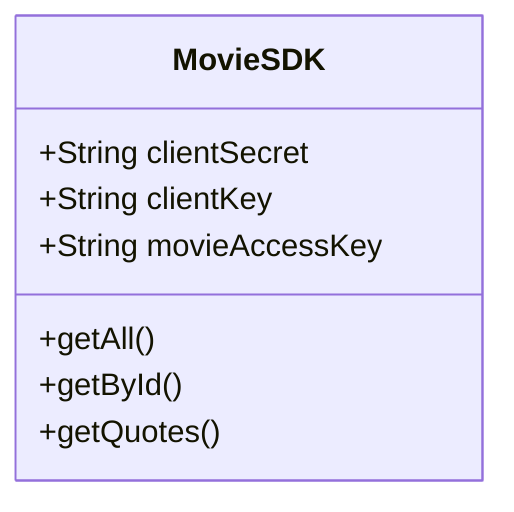
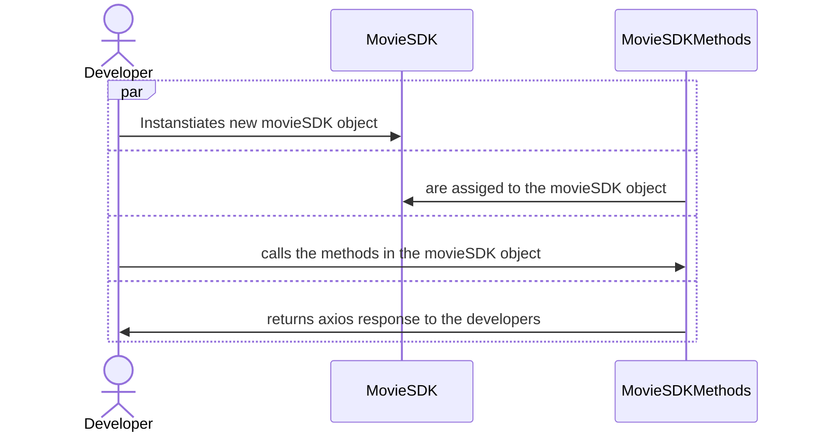

### Class Diagram of the Movie SDK

```mermaid
  classDiagram
    class MovieSDK{
        +String clientSecret
        +String clientKey
        +String movieAccessKey
        +getAll()
        +getById()
        +getQuotes()
    }
```
Developer Usage of the SDK

```mermaid
sequenceDiagram
    actor Developer
    participant MovieSDK
    participant MovieSDKMethods
    par
        Developer->>MovieSDK: Instanstiates new movieSDK object
    and
        MovieSDKMethods->>MovieSDK: are assiged to the movieSDK object
    and 
        Developer->>MovieSDKMethods: calls the methods in the movieSDK object
    and
        MovieSDKMethods->>Developer: returns axios response to the developers
    end

```
